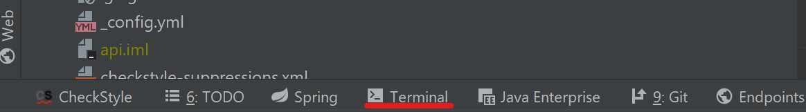
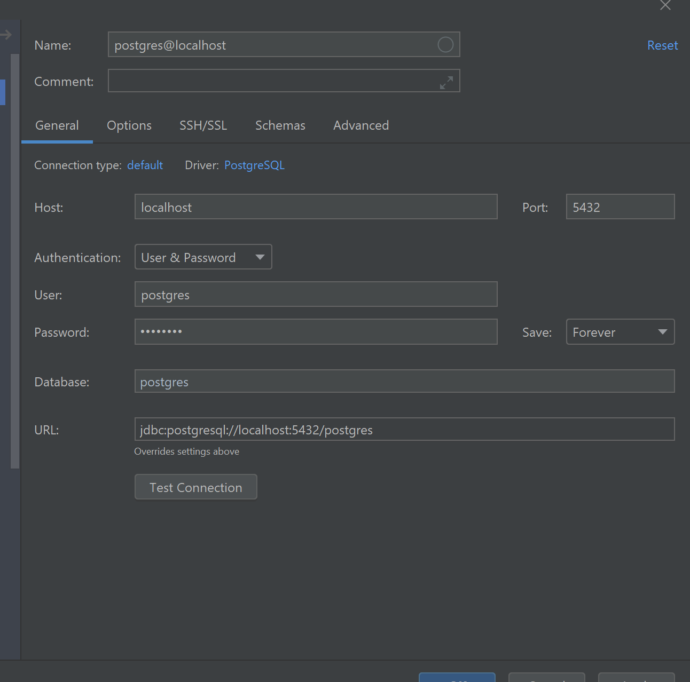

# PatternAtlas Developer Guide
This document provides an index to all development guidelines and background information of the PatternAtlas.
- [ADR](/adr) - Information on Architectural decisions can be found here

## Quick Develop
### PatternPediaAuth
PatternPediaAuth is a Spring Boot Authentication Server and it's main purpose is to give PatternAtlasAPI user management capabilities.
This is achieved through using the OAuth 2.0 Authentication Code Flow, additionally new users can create accounts.
It runs on Port 8081

### Development
1. Clone the repository `git clone https://github.com/PatternAtlas/pattern-pedia-auth.git`.
2. Navigate to repository directory `cd pattern-pedia-auth/`.
2. Build the repository 
    - `mvn package -DskipTests`(Windows) (skiping the tests for a faster build), Java 8 required.
    - `./mvnw clean package -DskipTests`(Unix) (skiping the tests for a faster build), Java 8 required.
#### Docker Installation
3. Build the image `docker build -t patternpedia/auth .` ([Docker](https://docs.docker.com/get-docker/) required)

##### Auth & DB
4. Navigate to directory  `..\.docker\`
5. Insert the following commands  `docker-compose -f docker-compose-with-db.yml up -d`

##### Auth
4. Navigate to directory  `..\.docker\`
5. Insert the following commands  `docker-compose up -d`

#### IntelliJ
3. [Follow PatternAtlasAPI from Step 5 pls](#step5)

#### Turn authentication on/off for PatternAtlasAPI
If you don't need the capabilities of the PatternPediaAuth server during development. You can follow the instructions in the following file 
[Security Config file](https://github.com/PatternAtlas/pattern-atlas-api/blob/ba-meyer-master/src/main/java/io/github/patternatlas/api/config/ResourceServerConfig.java)
to turn those off or on. An easier way will be added in a future realease.

#### Default User
During development default users are
- Admin: name: `admin@mail` password: `pass` 
- Member: name: `member@mail` password: `pass` 

### PatternAtlasAPI 
--->
1. Clone the repository `git clone https://github.com/PatternAtlas/pattern-atlas-api.git`.
2. Build the repository `mvn package -DskipTests` (skiping the tests for a faster build), Java 8 required.
3. Clone the repository `git clone https://github.com/PatternAtlas/pattern-atlas-ui.git`.
4. Build the repository `mvn package -DskipTests` (skiping the tests for a faster build), npm is required. (plus yarn, optionally)
5. Continue your IDE setup:
    - [IntelliJ Ultimate](IntelliJ/)
6. Set up database:
    - Open Terminal in IntelliJ
    
    - Navigate to directory  ``..\.docker\``
    - Insert the following commands ``docker-compose up -d``
    - Open "Database"
    
    - Click the "+"
    - Go to "Data Source > PostgresSQL"
    - Enter username and password: "postgres" (both)
    
    - Click "Apply"
    

7. Start the application (via the runconfig that you configured in step 5)

## Main API Endpoints
API-Root:   /

Swagger-UI: http://localhost:1977/swagger-ui

HAL - Browser: On "/" -> redirects to http://localhost:1977/explorer/index.html#uri=/

## License

See the NOTICE file(s) distributed with this work for additional
information regarding copyright ownership.

This program and the accompanying materials are made available under the Apache Software License 2.0 
which is available at https://www.apache.org/licenses/LICENSE-2.0.

SPDX-License-Identifier: Apache-2.0
